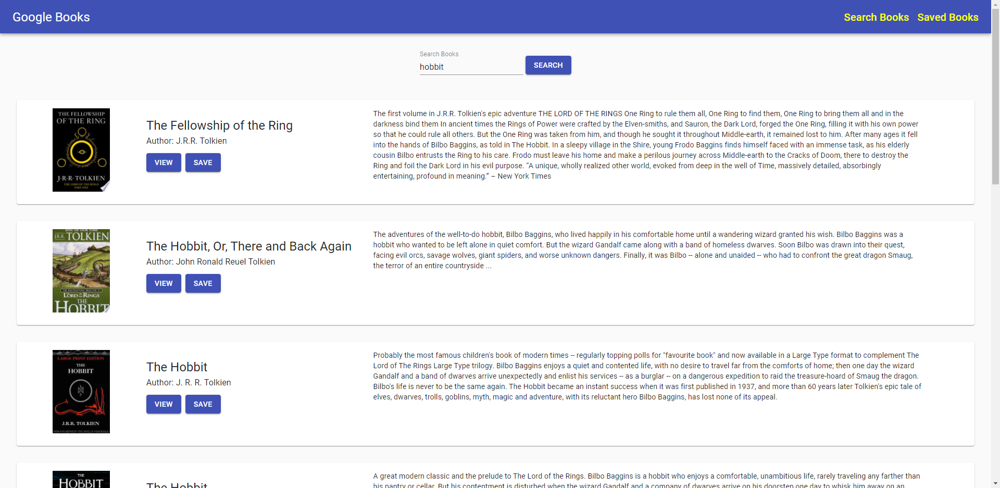

# Google Books Search

## Description

This app allows you to search through Google Books and save your favorite books for viewing later.

## Table of Contents

-   [Installation Instructions](#installation-instructions)
-   [Usage Information](#usage-information)
-   [License](#license)
-   [Contribution Guidelines](#contribution-guidelines)
-   [Test Instructions](#test-instructions)
-   [Questions](#questions)

## Installation Instructions

This app will be deployed to heroku where it is fully functional without any installation. If you want to download the app locally you will need to run npm install in the root directory to install all dependencies for the project.

## Usage Information

The user can search Google Books via the search bar to populate the books on the page. The save button will save the book to the database for quick viewing later. The view button takes you directly to Google Books for further information about the book.

Deployed Link: https://google-books-react-36203.herokuapp.com/

## License

This project is not utilizing a license

## Contribution Guidelines

This project is fully open source, any pull requests for improvements will be reviewed.

## Test Instructions

This app does not utilize tests

## Questions

If there are further questions please contact me with the following.

 AndrewMorrow- <a href="https://github.com/AndrewMorrow" target= "_blank">Github</a>

Email: beardedmongo@gmail.com
